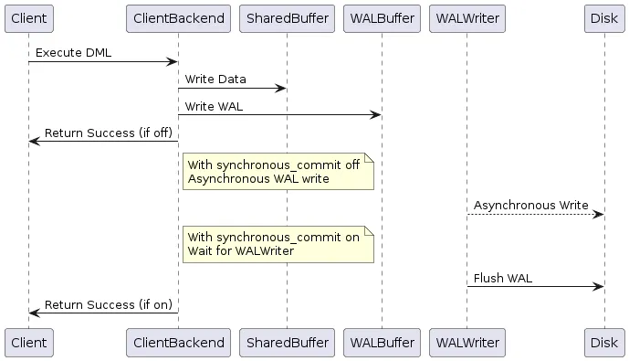
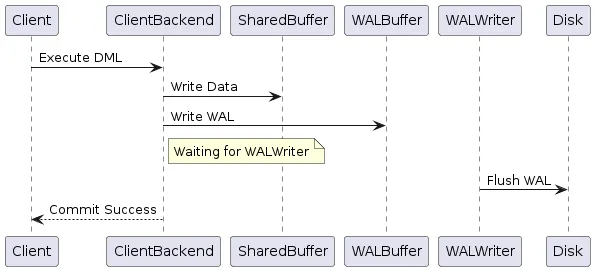

In PostgreSQL, the **synchronous_commit** configuration parameter plays a critical role in determining how transactions are committed and when the client receives acknowledgment of a transaction's success. This parameter impacts the trade-off between transaction durability and performance, making it essential to understand its behavior and implications.

### What is synchronous_commit?

**Synchronous_commit** is a configuration setting in PostgreSQL that controls the timing of how transaction commits are acknowledged to clients. It governs whether a transaction waits for data to be physically written to disk before returning a commit success status to the client.

### Components Involved in Transaction Handling
To comprehend **synchronous_commit** better, let's briefly discuss two key components involved in transaction processing:

* **Shared Buffer:** When a DML (Data Manipulation Language) operation (e.g., **INSERT, UPDATE, DELETE**) is executed, the client backend first writes the data into the shared buffer. The shared buffer is an in-memory cache that holds recently accessed data pages, optimizing read and write operations.
* **Write-Ahead Logging (WAL) Buffer:** Simultaneously, the backend writes the transaction changes into the WAL buffer. The WAL buffer is a separate area where PostgreSQL logs all changes made by transactions before they are applied to the data files on disk. This logging mechanism ensures data durability and crash recovery.

### How synchronous_commit works

#### When synchronous_commit is ON:

1. The client backend writes data to the shared buffer and WAL buffer.
2. PostgreSQL waits for the WAL writer process to flush the WAL data to disk, ensuring it’s durably stored

#### When synchronous_commit is OFF:

1. The backend immediately returns a transaction success status to the client after writing to the shared buffer and WAL buffer.
2. The WAL writer asynchronously flushes the WAL data to disk. If the server crashes before this occurs, there’s a risk of data loss.

The **synchronous_commit** setting in PostgreSQL can be configured at session, transaction, database, and cluster-wide scopes, allowing for flexibility in managing transaction durability based on different levels of granularity and applicability.

### Implications of synchronous_commit Setting

* **Data Durability vs. Performance:** Turning synchronous_commit off can boost transaction speed by reducing the I/O wait for disk writes but increases the risk of losing un-flushed data in case of a crash.
* **Transaction Speed:** With synchronous_commit off, transactions complete faster since there's no waiting for disk writes.
* **Data Integrity:** For critical data where data loss is unacceptable, keep synchronous_commit on to ensure durability and reduce the risk of losing committed transactions due to crashes.

### When to set synchronous_commit : ON ?

* In **financial applications**, it’s critical to maintain strict data consistency and prevent data loss. Turning **synchronous_commit** on ensures that transactions are safely stored on disk, minimising the risk of financial discrepancies or loss of transactional data.
* In **e-commerce**, maintaining accurate inventory levels and order history is essential. With synchronous_commit on, any order updates or inventory changes are immediately persisted, ensuring real-time visibility and accurate stock levels.

### When to set synchronous_commit : OFF ?

* When dealing with **data ingestion pipelines** where immediate durability may not be critical. Disabling synchronous_commit can significantly improve ingestion throughput by reducing disk I/O wait times, allowing faster data processing.
* For **logging** purposes where occasional data loss is acceptable, turning off synchronous_commit can boost logging performance without impacting overall system reliability.
* For **cache** or temporary data storage where data loss is tolerable and can be regenerated or fetched from another source, disabling synchronous_commit can improve overall system responsiveness and reduce overhead.

## Conclusion

Understanding and configuring **synchronous_commit** in PostgreSQL is crucial for balancing performance and data durability based on specific application requirements. By leveraging this configuration effectively, PostgreSQL users can optimize transactional behaviour to suit diverse use cases, from high-performance data ingestion to critical transactional systems.