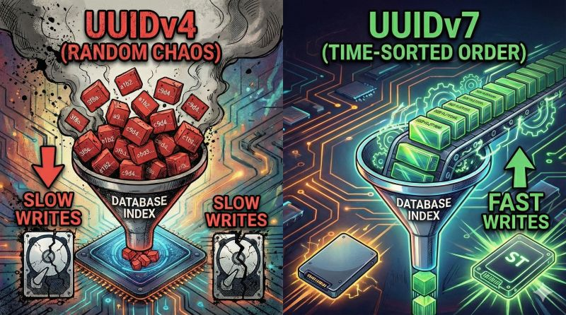

### Stop using UUIDv4 for your Primary Keys. It’s killing your database performance. 🛑

We all love UUIDs. They are easy, global, and collision-free. But if you are blindly throwing standard UUIDv4 into a SQL database (Postgres, MySQL) as a Primary Key, you might be creating a performance bottleneck you can't see yet.

---

### Here is the reality check:

Database indexes (B-Trees) crave order. They are designed to be sequential.
UUIDv4 is pure, mathematical chaos.
Every time you insert a totally random ID, your database can’t just append it to the end. It has to hunt down the specific page where that ID belongs.
If that page is full? It forces a "Page Split" literally moving data around on the disk just to make space.
The result:

📉 Your index gets fragmented.
📉 Your Disk I/O spikes.
📉 Your write speeds tank as the table grows.

---

### ​The Fix: UUIDv7

UUIDv7 is the "layout hack" we’ve been waiting for. It solves the index problem by changing the structure of the ID itself:
​1️⃣ Timestamp First (48 bits): The beginning of the ID is generated from the current time.
2️⃣ Randomness Second (74 bits): The rest is random noise to guarantee uniqueness.

---

### ​Why this matters:
Because it starts with a timestamp, the database treats it almost like an auto-incrementing Integer. It appends new rows sequentially at the end of the index.

​✅ No fragmentation.
✅ No crazy page splits.
✅ Just happy, compact B-Trees.

​If you’re designing a schema today, do yourself a favor and look at v7. You get the security of a UUID with the write performance of an Integer.

---

