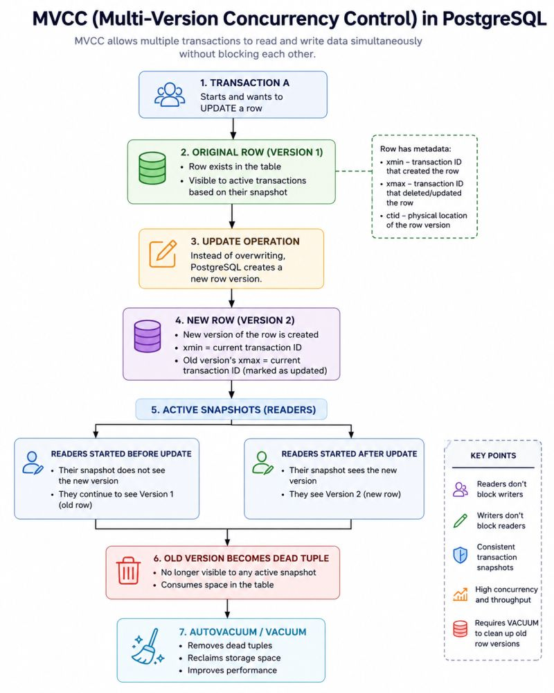

 Understanding MVCC in PostgreSQL: The Secret Behind High-Concurrency Databases

One of the features that makes PostgreSQL such a powerful enterprise database is Multi-Version Concurrency Control (MVCC).

MVCC allows multiple users to read and write data simultaneously without blocking each other, significantly improving performance and scalability in transactional environments.

Instead of overwriting rows during an UPDATE, PostgreSQL creates a new version of the row while retaining the old version until it is no longer needed by active transactions.

📌 Key Benefits of MVCC:

✅ Readers don’t block writers

✅ Writers don’t block readers

✅ Consistent transaction snapshots

✅ Improved concurrency and throughput

✅ Better performance for high-volume OLTP workloads

Understanding MVCC is also critical when troubleshooting common PostgreSQL challenges such as:

• Table bloat

• Long-running transactions

• Replication lag

• Vacuum and Autovacuum performance

• Transaction visibility issues

Recently, while working with PostgreSQL replication and high-availability environments, I’ve gained a deeper appreciation for how MVCC impacts transaction visibility, VACUUM behavior, WAL generation, and overall database performance. Understanding these internals has been invaluable when troubleshooting production systems and ensuring database reliability.

MVCC isn’t just a PostgreSQL feature—it’s one of the core reasons PostgreSQL scales so effectively under concurrent workloads.

