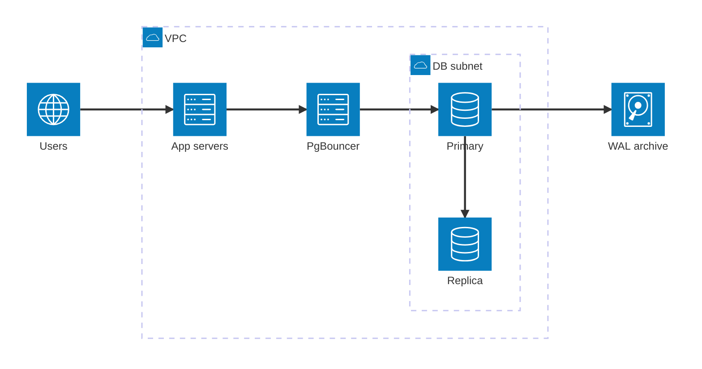
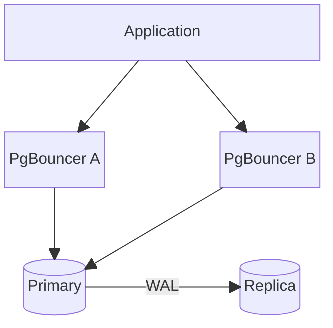
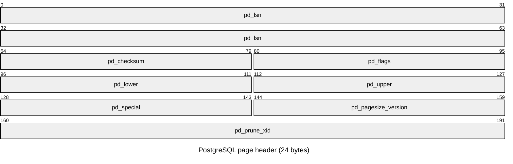
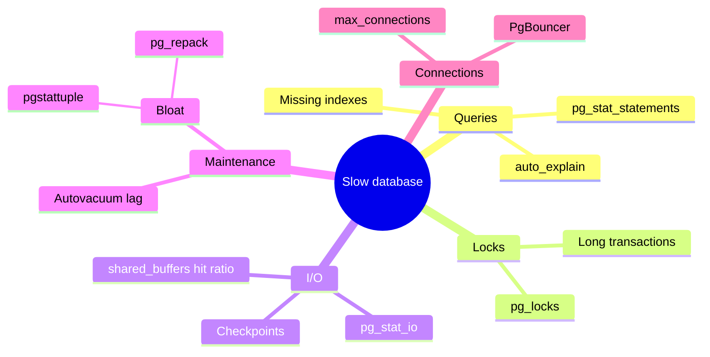

# Architecture & Layout

## Architecture diagram (architecture-beta)

Built-in icons: `cloud`, `database`, `disk`, `internet`, `server`.

## Block diagram (block-beta)

## Packet diagram (packet-beta) — heap page header

The 24-byte `PageHeaderData` at the start of every 8 KB page.

## Mind map — performance troubleshooting

