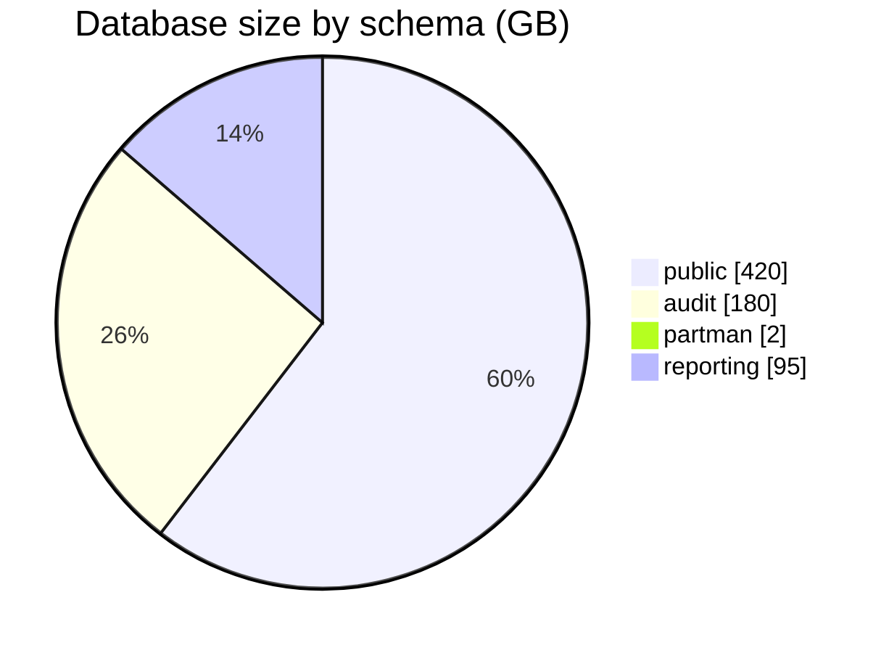
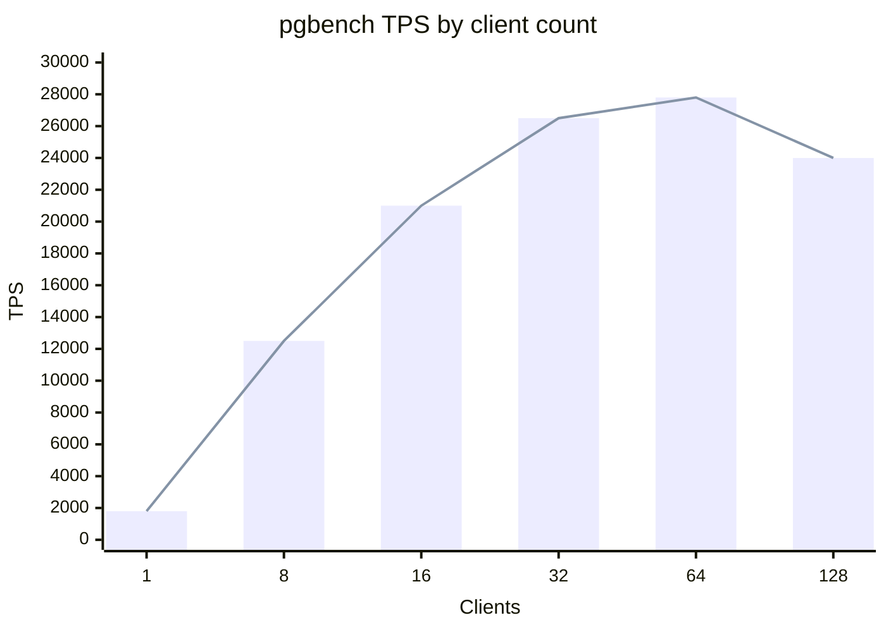
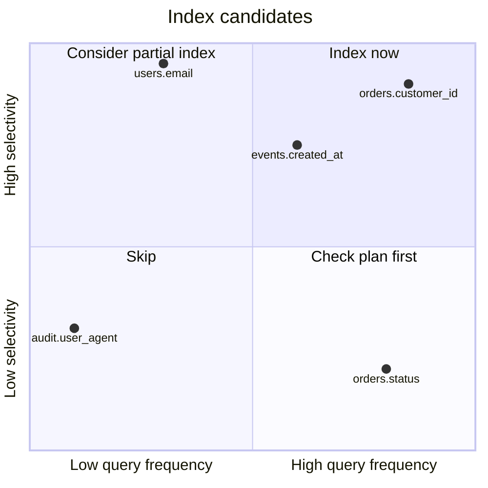
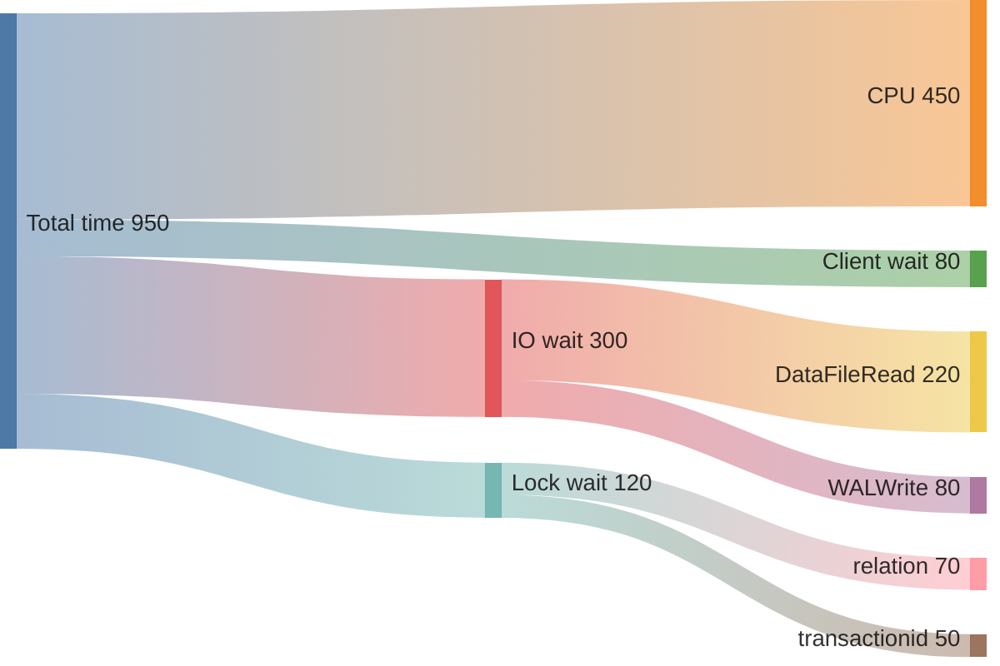
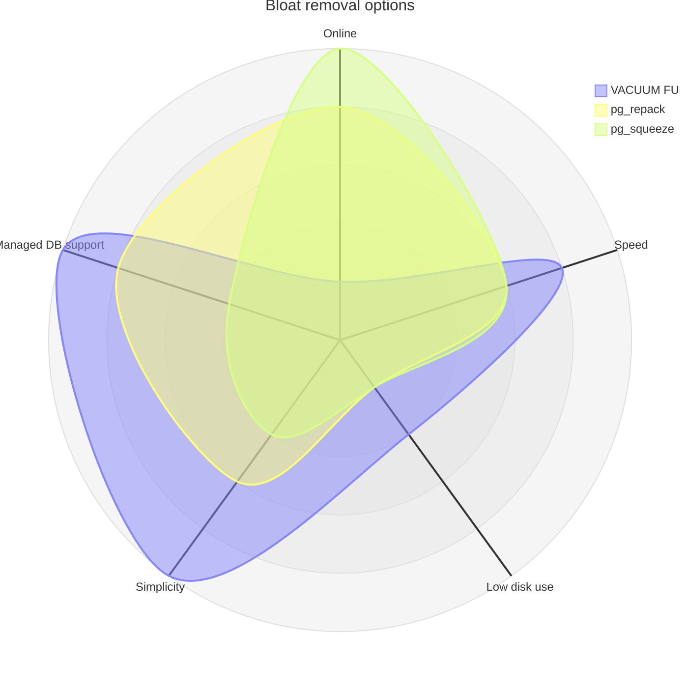

# Charts

## Pie — database size by schema

```mermaid
pie showData
    title Database size by schema (GB)
    "public" : 420
    "audit" : 180
    "partman" : 2
    "reporting" : 95
```

## XY chart — pgbench TPS vs clients

```mermaid
xychart-beta
    title "pgbench TPS by client count"
    x-axis "Clients" [1, 8, 16, 32, 64, 128]
    y-axis "TPS" 0 --> 30000
    bar [1800, 12500, 21000, 26500, 27800, 24000]
    line [1800, 12500, 21000, 26500, 27800, 24000]
```

## Quadrant — index candidates

```mermaid
quadrantChart
    title Index candidates
    x-axis Low query frequency --> High query frequency
    y-axis Low selectivity --> High selectivity
    quadrant-1 Index now
    quadrant-2 Consider partial index
    quadrant-3 Skip
    quadrant-4 Check plan first
    orders.customer_id: [0.85, 0.9]
    orders.status: [0.8, 0.2]
    events.created_at: [0.6, 0.75]
    audit.user_agent: [0.1, 0.3]
    users.email: [0.3, 0.95]
```

## Sankey — where query time goes

```mermaid
sankey-beta
Total time,CPU,450
Total time,IO wait,300
Total time,Lock wait,120
Total time,Client wait,80
IO wait,DataFileRead,220
IO wait,WALWrite,80
Lock wait,relation,70
Lock wait,transactionid,50
```

## Radar (11.6+) — extension trade-offs

```mermaid
radar-beta
    title Bloat removal options
    axis online["Online"], speed["Speed"], disk["Low disk use"], simple["Simplicity"], managed["Managed DB support"]
    curve vf["VACUUM FULL"]{1, 4, 2, 5, 5}
    curve repack["pg_repack"]{4, 3, 1, 3, 4}
    curve squeeze["pg_squeeze"]{5, 3, 1, 2, 2}
    max 5
    min 0
```
