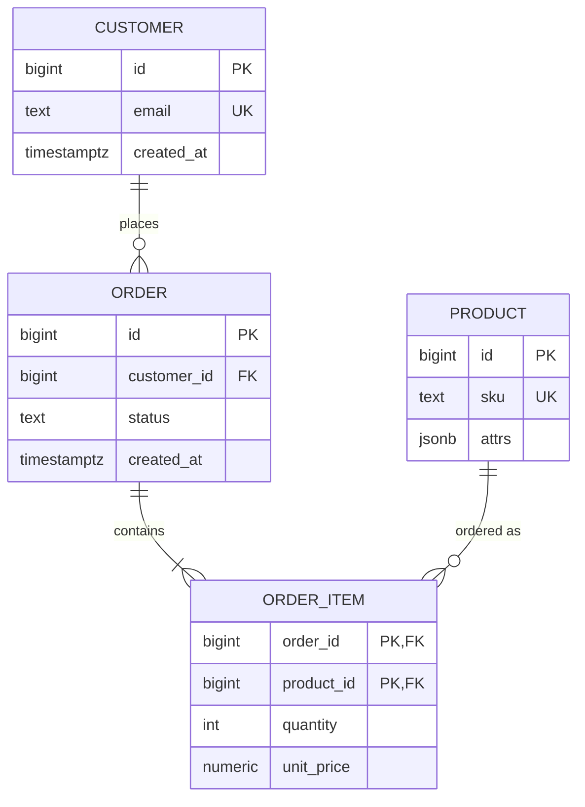
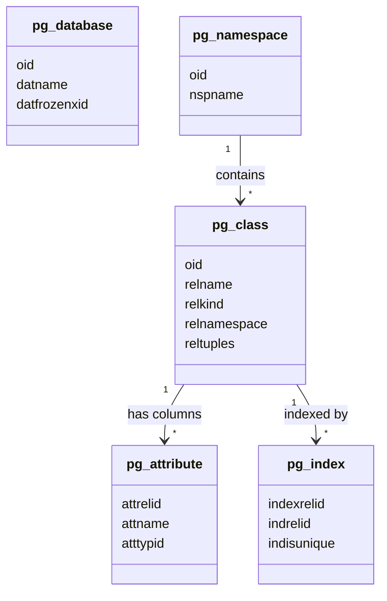
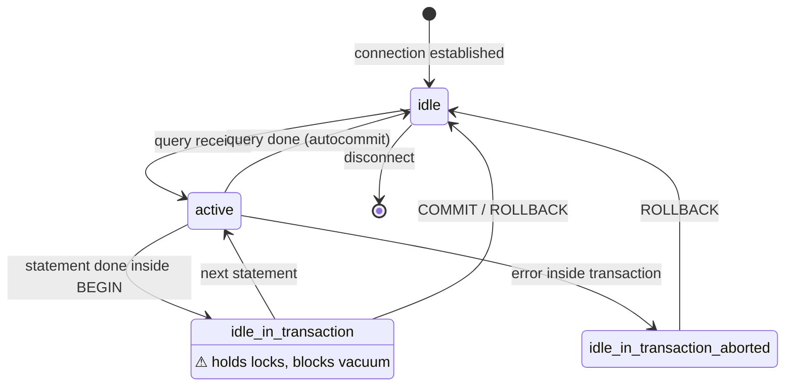
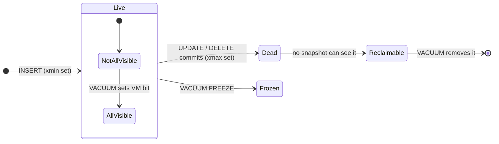

# Data Models & State

## ER diagram

## Class diagram — catalog relationships

## State diagram — backend state (pg_stat_activity.state)

!!! warning "idle in transaction"
    Sessions sitting in `idle_in_transaction` hold their locks and prevent vacuum from removing dead tuples.
    Cap them with `idle_in_transaction_session_timeout`.

!!! note "Mermaid notes in state diagrams"
    Zensical's theme styles notes in sequence diagrams, but not `note … end note` blocks in **state diagrams**:
    they keep Mermaid's default black text and can overflow their box. Put the text in a state description
    (`state_id : text`) or an admonition instead.

## State diagram — tuple lifecycle under MVCC

