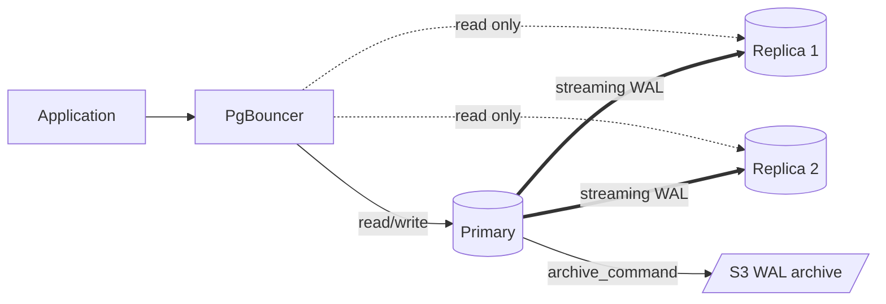
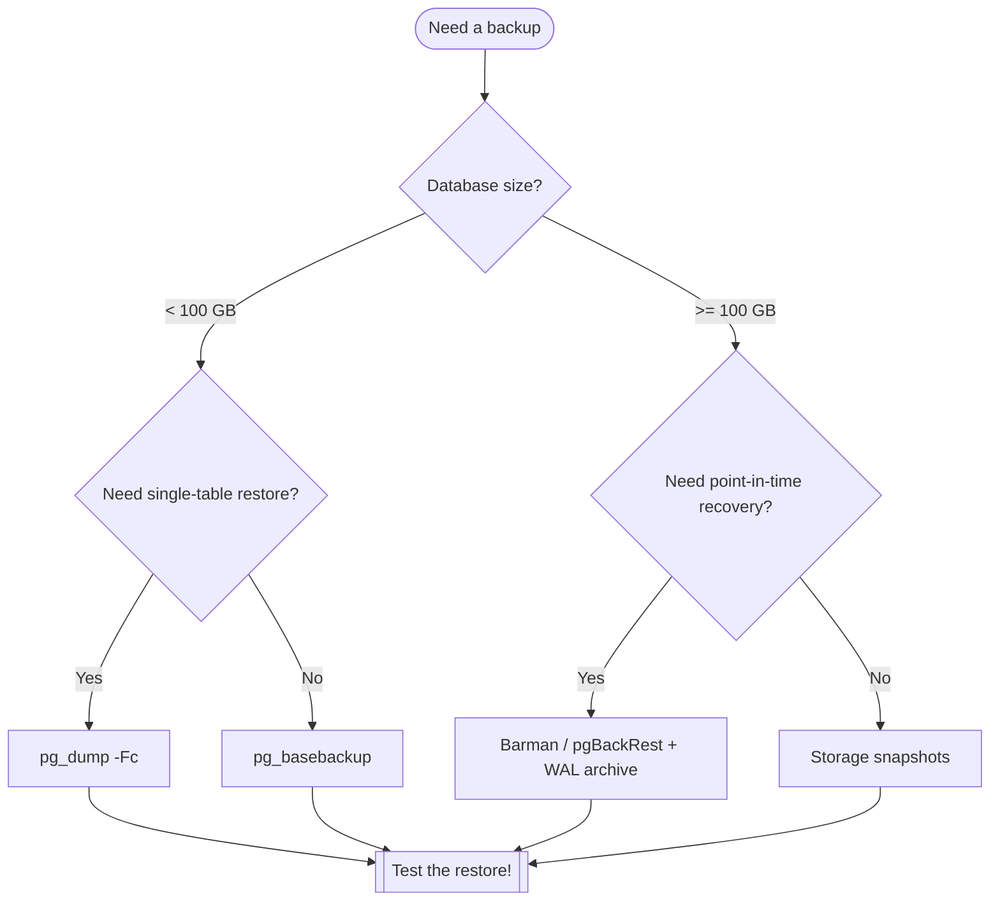
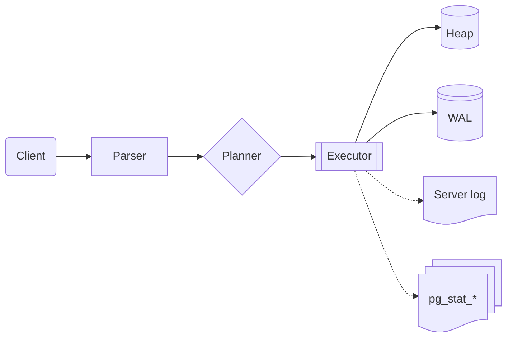
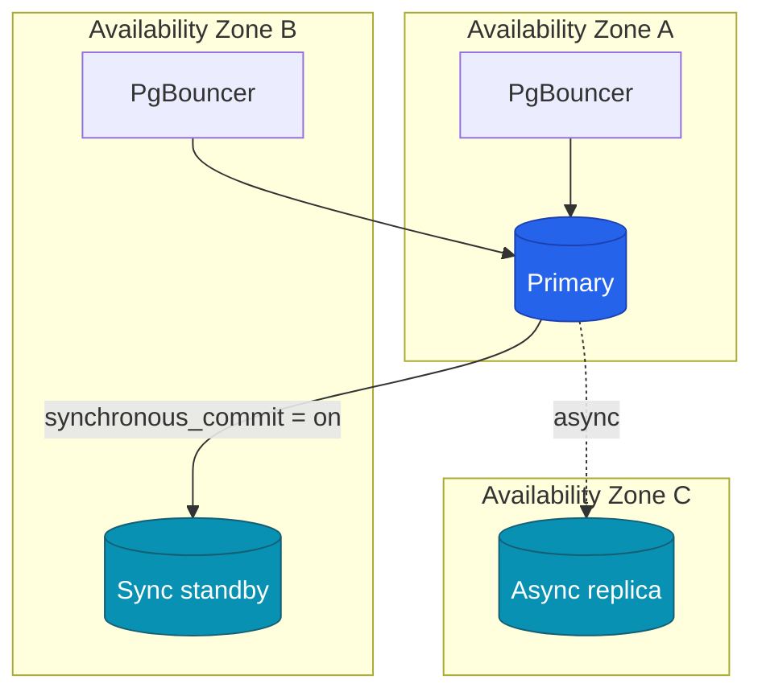
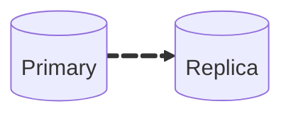

# Flowcharts

## Replication topology

## Decision flow: which backup tool?

## Mermaid 11 shape syntax

Mermaid 11.3+ adds 30+ new shapes using `id@{ shape: …, label: "…" }`.

## Subgraphs and styling

## Animated edges (11.5+)

