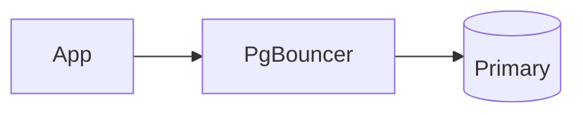

# Mermaid Samples

Sample [Mermaid 11](https://mermaid.js.org/) diagrams, PostgreSQL-themed, to copy and adapt.

Mermaid is loaded by Zensical from `https://unpkg.com/mermaid@11`, so every diagram here renders client-side in the browser.

## How to add a diagram

````markdown

````


## Pages

| Page | Diagram types |
|---|---|
| [Flowcharts](flowcharts.md) | `flowchart` — classic shapes, Mermaid 11 `@{ shape: … }` syntax, subgraphs, styling |
| [Sequence Diagrams](sequence-diagrams.md) | `sequenceDiagram` |
| [Data Models & State](data-models-and-state.md) | `erDiagram`, `classDiagram`, `stateDiagram-v2` |
| [Planning & Process](planning-and-process.md) | `gantt`, `timeline`, `journey`, `kanban`, `gitGraph` |
| [Charts](charts.md) | `pie`, `xychart-beta`, `quadrantChart`, `sankey-beta`, `radar-beta` |
| [Architecture & Layout](architecture-and-layout.md) | `architecture-beta`, `block-beta`, `packet-beta`, `mindmap` |

!!! tip
    Use the [Mermaid Live Editor](https://mermaid.live) to prototype a diagram before pasting it into the wiki.
    Diagram types ending in `-beta` are newer and their syntax may still change between 11.x releases.
