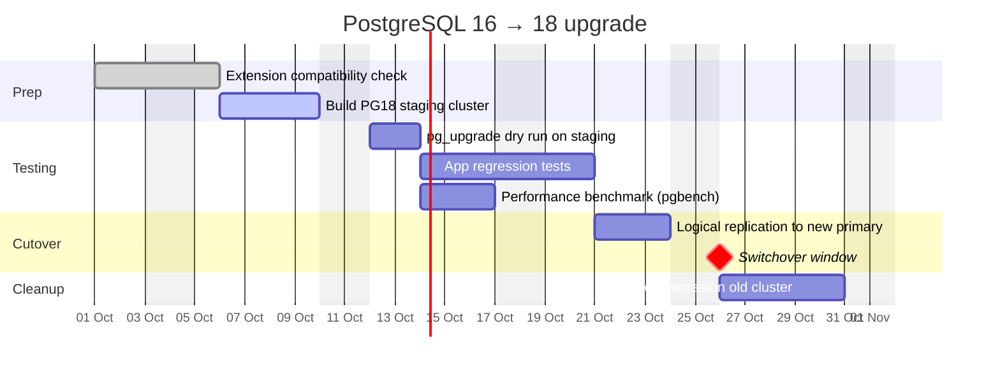
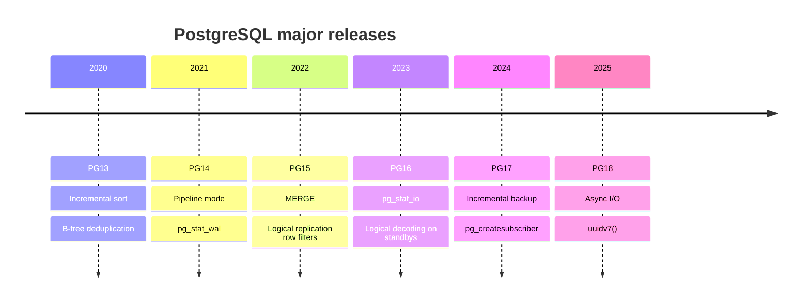
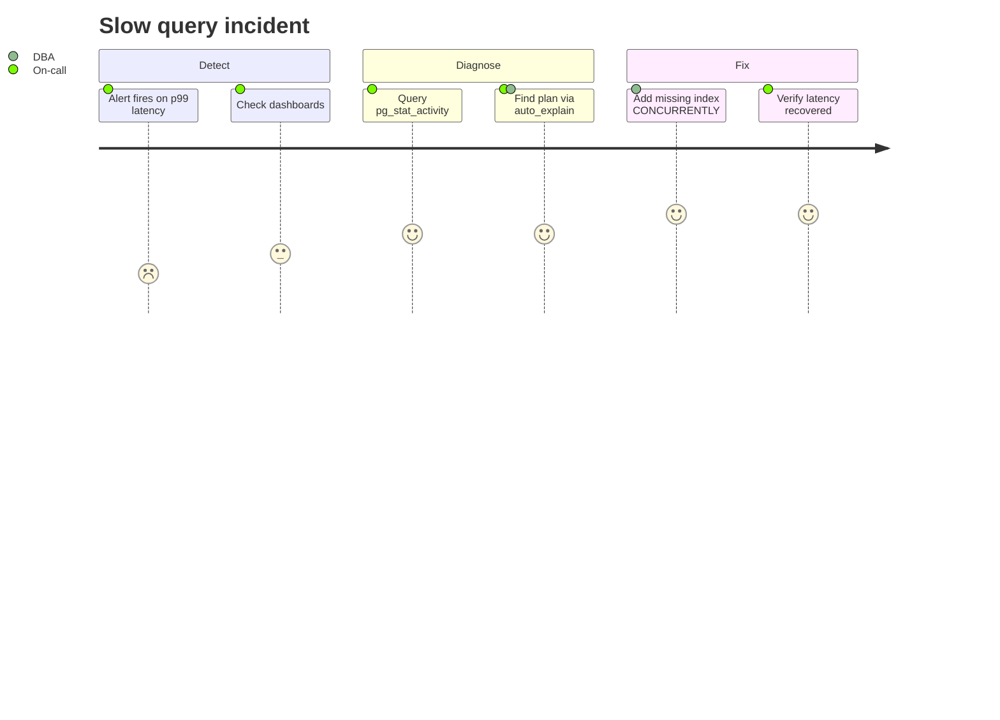
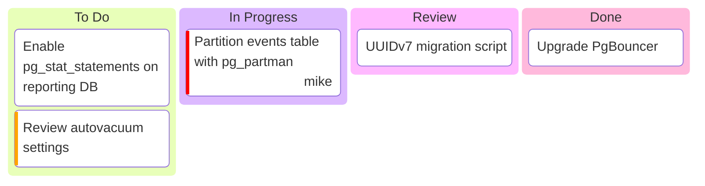
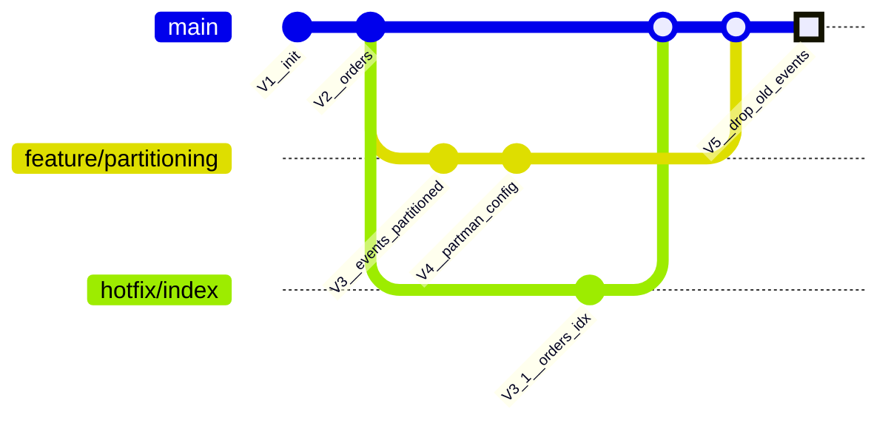

# Planning & Process

## Gantt — major version upgrade plan

## Timeline — recent PostgreSQL releases

## User journey — on-call slow query incident

## Kanban (11.4+)

## Git graph — schema migration branches

