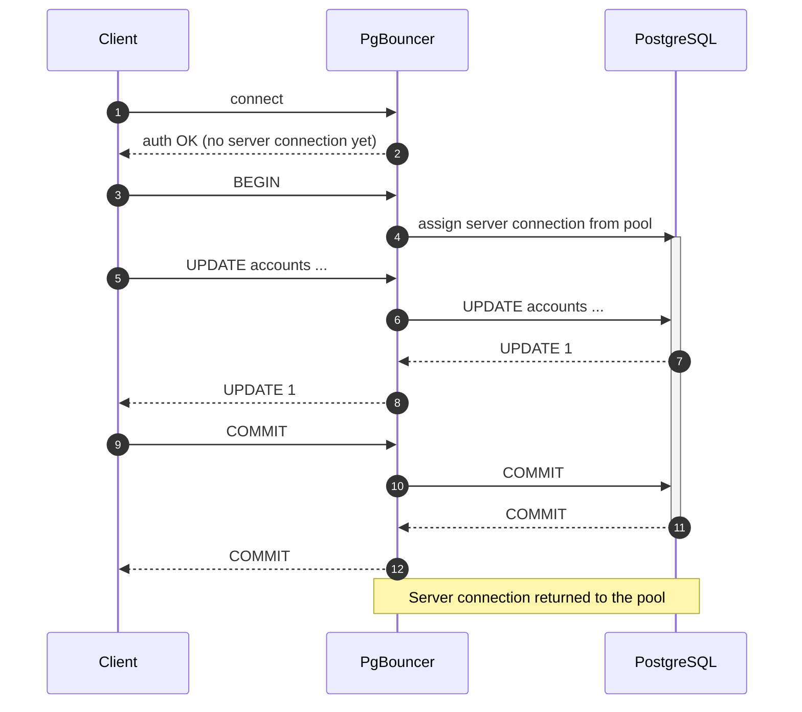
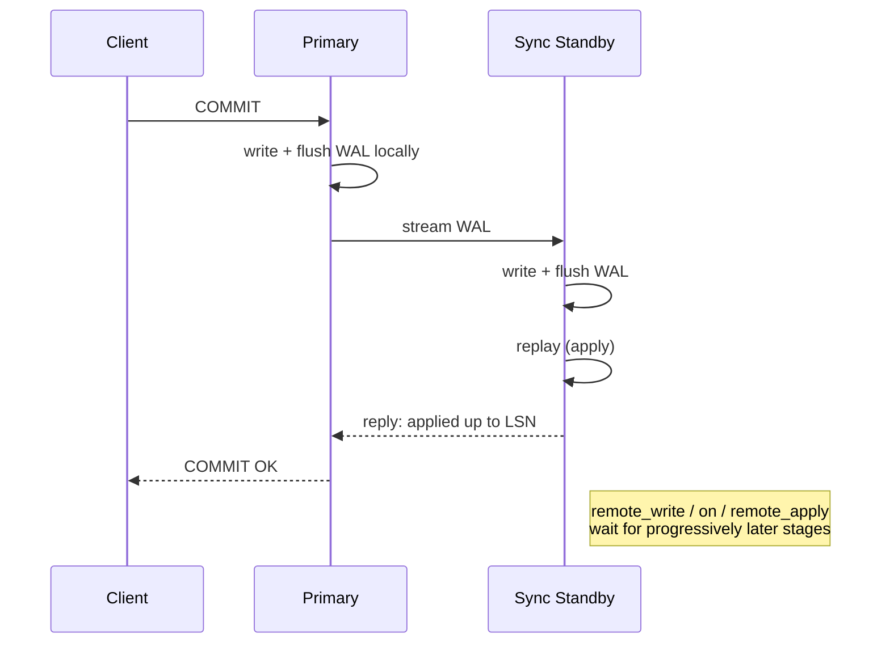
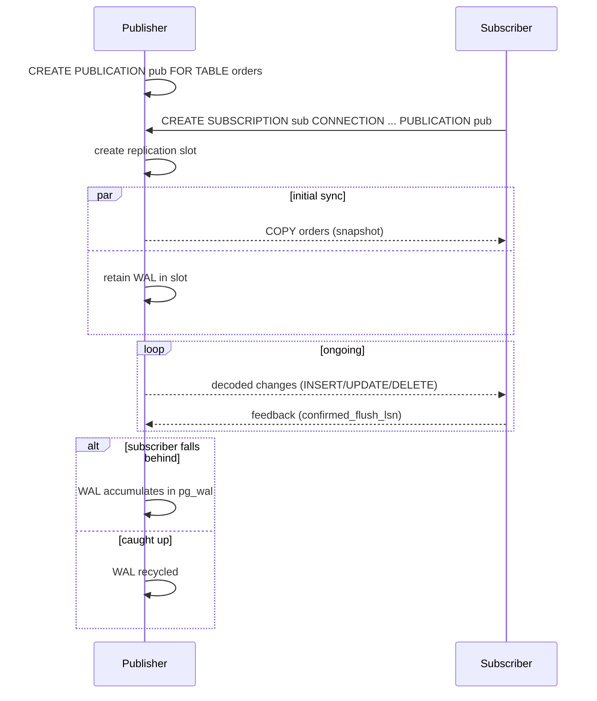
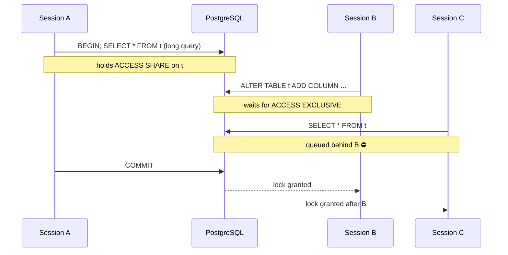

# Sequence Diagrams

## Transaction through PgBouncer (transaction pooling)

```mermaid
sequenceDiagram
    autonumber
    participant C as Client
    participant B as PgBouncer
    participant P as PostgreSQL

    C->>B: connect
    B-->>C: auth OK (no server connection yet)
    C->>B: BEGIN
    B->>P: assign server connection from pool
    activate P
    C->>B: UPDATE accounts ...
    B->>P: UPDATE accounts ...
    P-->>B: UPDATE 1
    B-->>C: UPDATE 1
    C->>B: COMMIT
    B->>P: COMMIT
    P-->>B: COMMIT
    deactivate P
    B-->>C: COMMIT
    Note over B,P: Server connection returned to the pool
```

## synchronous_commit = remote_apply

```mermaid
sequenceDiagram
    participant C as Client
    participant P as Primary
    participant S as Sync Standby

    C->>P: COMMIT
    P->>P: write + flush WAL locally
    P->>S: stream WAL
    S->>S: write + flush WAL
    S->>S: replay (apply)
    S-->>P: reply: applied up to LSN
    P-->>C: COMMIT OK
    Note right of S: remote_write / on / remote_apply<br/>wait for progressively later stages
```

## Logical replication setup

```mermaid
sequenceDiagram
    participant Pub as Publisher
    participant Sub as Subscriber

    Pub->>Pub: CREATE PUBLICATION pub FOR TABLE orders
    Sub->>Pub: CREATE SUBSCRIPTION sub CONNECTION ... PUBLICATION pub
    Pub->>Pub: create replication slot
    par initial sync
        Pub-->>Sub: COPY orders (snapshot)
    and
        Pub->>Pub: retain WAL in slot
    end
    loop ongoing
        Pub-->>Sub: decoded changes (INSERT/UPDATE/DELETE)
        Sub-->>Pub: feedback (confirmed_flush_lsn)
    end
    alt subscriber falls behind
        Pub->>Pub: WAL accumulates in pg_wal
    else caught up
        Pub->>Pub: WAL recycled
    end
```

## Lock wait / blocking

```mermaid
sequenceDiagram
    participant A as Session A
    participant DB as PostgreSQL
    participant B as Session B
    participant C as Session C

    A->>DB: BEGIN#59; SELECT * FROM t (long query)
    Note over A,DB: holds ACCESS SHARE on t
    B->>DB: ALTER TABLE t ADD COLUMN ...
    Note over B,DB: waits for ACCESS EXCLUSIVE
    C->>DB: SELECT * FROM t
    Note over C,DB: queued behind B ⛔
    A->>DB: COMMIT
    DB-->>B: lock granted
    DB-->>C: lock granted after B
```
