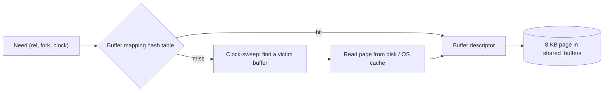

# Buffer pool, descriptors and the mapping hash

Three structures in shared memory:

| Structure | Contents |
|---|---|
| **Buffer blocks** | `shared_buffers / 8 KB` page slots holding the actual page images |
| **Buffer descriptors** | One per slot: **buffer tag** (relfilenode, fork, block number), atomic state (**refcount / pin count**, **usage count**, flags `BM_DIRTY`, `BM_VALID`, `BM_IO_IN_PROGRESS`…), content lock |
| **Buffer mapping hash table** | buffer tag → buffer id; split into **128 partitions**, each protected by a `BufferMapping` LWLock |

Access protocol:

1. Look up the tag in the mapping table (shared partition lock).
2. **Pin** the buffer (increment refcount) — a pinned buffer can't be evicted.
3. Take the buffer **content lock** (shared for read, exclusive for modify).
4. Read/modify the page; if modified, mark dirty and WAL-log.
5. Release content lock and unpin.

Wait events to watch: `LWLock:BufferMapping` (mapping contention), `LWLock:BufferContent` (hot pages, e.g. the right-most B-tree leaf), `IO:DataFileRead`.
