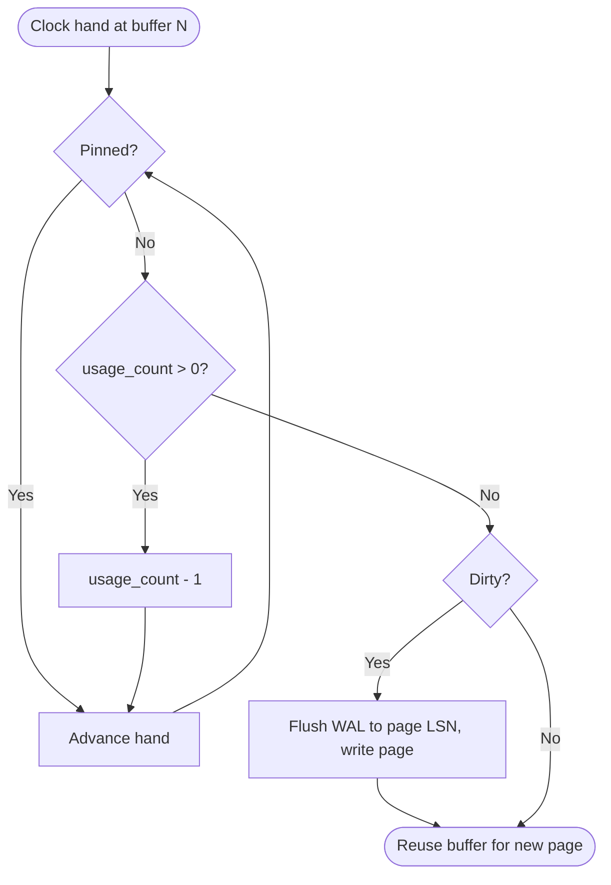

# Clock-sweep eviction and usage counts

When a page isn't cached, a free buffer is needed. PostgreSQL uses **clock-sweep**, an approximation of LRU:

- Each buffer has a `usage_count` (0–5). Every pin increments it (capped at 5).
- A shared "clock hand" (`nextVictimBuffer`) walks round the pool. For each buffer:
    - pinned → skip
    - `usage_count > 0` → decrement and move on
    - `usage_count = 0` and unpinned → **victim**
- If the victim is dirty, it must be written (after flushing WAL up to its `pd_lsn`) before reuse — and if the **backend** has to do that write itself, the query is slowed.



Frequently-used pages keep high usage counts and survive; one-off reads drop out quickly. Check the distribution with [pg_buffercache](../../extensions/pg-buffercache/index.md):

```sql
SELECT usagecount, count(*) FROM pg_buffercache GROUP BY 1 ORDER BY 1;
```
