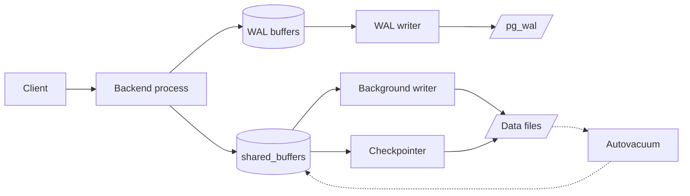

# Postgres Internals

How PostgreSQL works under the hood — processes, memory, on-disk layout, MVCC, vacuum, WAL and the buffer manager.

| Section | Covers |
|---|---|
| [Process and Memory Architecture](process-and-memory-architecture/index.md) | Postmaster, backends, auxiliary processes, shared vs local memory, DSM and parallel query |
| [Storage Layout](storage-layout/index.md) | Data directory, relfilenodes, segments and forks, page and tuple layout, TOAST, FSM / VM |
| [MVCC and Transaction Management](mvcc-and-transaction-management/index.md) | XIDs and wraparound, snapshots, hint bits and clog, isolation levels / SSI, subtransactions, multixacts, 2PC |
| [Vacuum and Bloat Management](vacuum-and-bloat-management/index.md) | Dead tuples and HOT, VACUUM phases, autovacuum tuning, freezing, bloat causes and fixes |
| [Write-Ahead Logging and Durability](wal-and-durability/index.md) | WAL records and LSNs, full-page writes, checkpoints, crash recovery, synchronous_commit, archiving / PITR |
| [Buffer Manager and I/O](buffer-manager-and-io/index.md) | Buffer pool, clock-sweep, ring buffers, who writes dirty pages, OS cache, direct and async I/O |

!!! tip "Hands-on extensions for exploring internals"
    `pageinspect` (raw pages and tuples), `pg_visibility`, `pg_freespacemap`, [pg_buffercache](../extensions/pg-buffercache/index.md),
    [pgstattuple](../extensions/pgstattuple/index.md) and the `pg_waldump` command-line tool.
