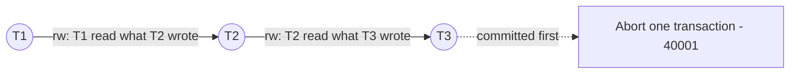

# Isolation levels and SSI

| Level | Snapshot | Prevents | Can still see |
|---|---|---|---|
| Read Uncommitted | (behaves as Read Committed in PostgreSQL) | — | — |
| **Read Committed** (default) | Per statement | Dirty reads | Non-repeatable reads, phantoms, lost-update style anomalies |
| **Repeatable Read** | Per transaction (snapshot isolation) | Non-repeatable reads, phantoms | Write skew |
| **Serializable** | Per transaction + SSI | All anomalies | — (may abort with `40001`) |

- In Repeatable Read, if you try to update a row that a concurrent transaction updated after your snapshot, you get `ERROR: could not serialize access due to concurrent update` — retry the transaction.
- In Read Committed, the update re-reads the latest version of the row (`EvalPlanQual`) and re-checks the `WHERE` clause instead.

## Serializable Snapshot Isolation (SSI)

Serializable = snapshot isolation + tracking of **read/write dependencies**:

- Reads take **SIREAD predicate locks** (on tuples, pages or whole relations — escalated as counts grow). They never block anyone; they just record what was read.
- When a transaction writes something another concurrent transaction read, an **rw-conflict** (rw-antidependency) is recorded.
- A **dangerous structure** — two consecutive rw-conflicts `T1 → T2 → T3` where T3 committed first — means a cycle *might* exist, so one transaction is aborted with `ERROR: could not serialize access due to read/write dependencies among transactions` (SQLSTATE `40001`).



```sql
SELECT locktype, relation::regclass, page, tuple, pid
FROM pg_locks WHERE mode = 'SIReadLock';
```

Tips: keep serializable transactions short, mark read-only ones `READ ONLY` (or `DEFERRABLE` for long reports), use indexes so predicate locks stay fine-grained, and always have retry logic. Tune with `max_pred_locks_per_transaction`, `max_pred_locks_per_relation`, `max_pred_locks_per_page`.
