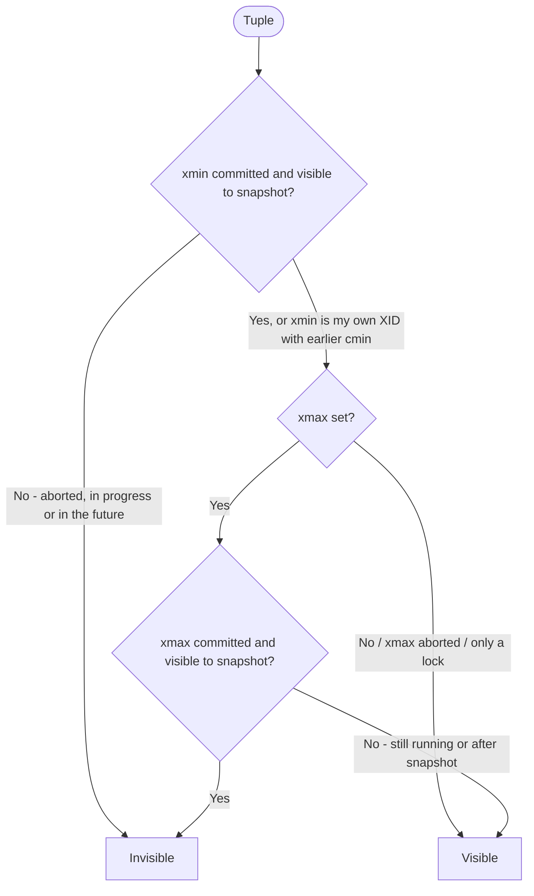

# Snapshots and visibility rules

A **snapshot** captures which transactions were finished at a point in time:

| Field | Meaning |
|---|---|
| `xmin` | Oldest XID still running — everything below is finished (committed or aborted) |
| `xmax` | First XID not yet assigned — everything ≥ is invisible (in the future) |
| `xip` | List of XIDs in `[xmin, xmax)` that were in progress — treat as invisible |

```sql
SELECT pg_current_snapshot();   -- e.g. 748:752:748,750
```

## Visibility check (simplified) for a tuple version



"Visible to snapshot" = XID < snapshot `xmax`, not in `xip`, and committed per clog.

When the snapshot is taken depends on the isolation level:

- **Read Committed** — a new snapshot for **every statement**.
- **Repeatable Read / Serializable** — one snapshot at the **first statement** of the transaction.

The oldest `xmin` across all backends (plus replication slots, standbys with feedback, prepared xacts) is the **xmin horizon** — VACUUM can't remove anything newer.

```sql
SELECT pid, backend_xid, backend_xmin, state, xact_start, left(query, 60)
FROM pg_stat_activity
WHERE backend_xmin IS NOT NULL
ORDER BY age(backend_xmin) DESC;
```
