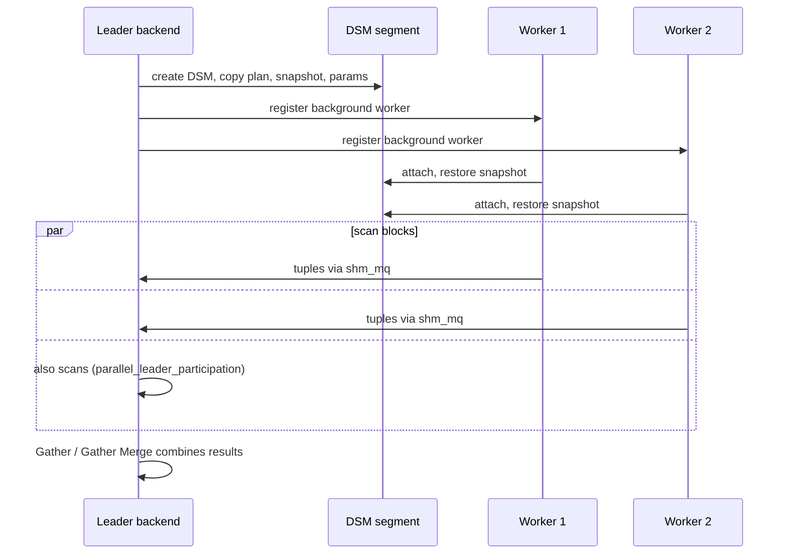

# Dynamic shared memory and parallel query

Fixed shared memory can't grow, so PostgreSQL also creates **dynamic shared memory (DSM)** segments on demand — mainly for parallel query.

- `dynamic_shared_memory_type` — `posix` (Linux default, `/dev/shm`), `sysv`, `mmap`.
- `min_dynamic_shared_memory` (PG14+) — preallocate a DSM area at startup (can use huge pages).
- **DSA** (dynamic shared area) — allocator on top of DSM, used e.g. by parallel hash join's shared hash table and the PG15+ cumulative statistics system.

## How a parallel query runs



| Setting | Default | Meaning |
|---|---|---|
| `max_worker_processes` | 8 | Total background workers (restart) |
| `max_parallel_workers` | 8 | Of those, how many may be parallel query workers |
| `max_parallel_workers_per_gather` | 2 | Per Gather node |
| `max_parallel_maintenance_workers` | 2 | `CREATE INDEX`, `VACUUM` index phase |
| `min_parallel_table_scan_size` | 8 MB | Table size before a parallel scan is considered |
| `parallel_setup_cost` / `parallel_tuple_cost` | 1000 / 0.1 | Planner cost of going parallel |

```sql
EXPLAIN (ANALYZE) SELECT count(*) FROM big_table;
-- Finalize Aggregate
--   ->  Gather  (Workers Planned: 2, Workers Launched: 2)
--         ->  Partial Aggregate
--               ->  Parallel Seq Scan on big_table
```

`Workers Launched` < `Workers Planned` means the pool (`max_parallel_workers`) was exhausted.
