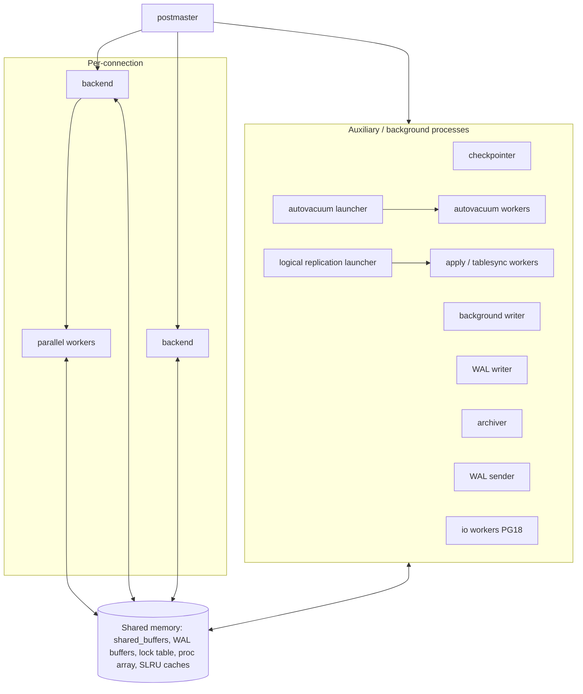

# Process and Memory Architecture

## Pages

| Page |
|---|
| [Postmaster, backends and process-per-connection](postmaster-and-backends.md) |
| [Auxiliary processes](auxiliary-processes.md) |
| [Shared memory](shared-memory.md) |
| [Local (per-backend) memory](local-memory.md) |
| [Dynamic shared memory and parallel query](dynamic-shared-memory-and-parallel-query.md) |
