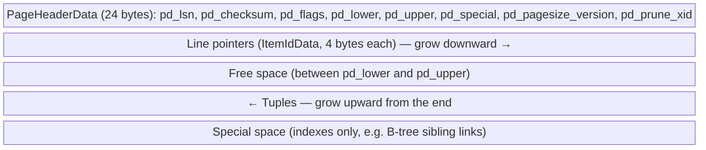

# Page layout

Every fork is an array of fixed-size **pages** (blocks), 8 KB by default (`block_size`, compile-time).



- **Line pointers** (`lp_off`, `lp_flags`, `lp_len`) give each tuple a stable slot number. A tuple's address (**TID / ctid**) is `(block, line pointer)`, e.g. `(0,3)`. Tuples can be moved within the page (defragmentation) without changing their TID.
- `lp_flags`: `LP_UNUSED`, `LP_NORMAL`, `LP_REDIRECT` (HOT chain), `LP_DEAD`.
- `pd_lsn` = LSN of the last WAL record that changed the page — the buffer manager must flush WAL up to it before writing the page (WAL-before-data rule).
- Heap pages have no special space; index pages do.

```sql
CREATE EXTENSION IF NOT EXISTS pageinspect;

SELECT * FROM page_header(get_raw_page('orders', 0));
--    lsn     | checksum | flags | lower | upper | special | pagesize | version | prune_xid

SELECT lp, lp_off, lp_flags, lp_len, t_xmin, t_xmax, t_ctid
FROM heap_page_items(get_raw_page('orders', 0))
LIMIT 10;
```
