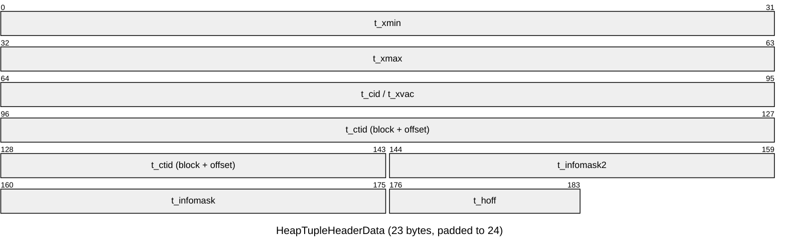

# Tuple structure

Each heap tuple = **23-byte header** + optional null bitmap + padding + column data.



| Field | Meaning |
|---|---|
| `t_xmin` | XID that inserted this version |
| `t_xmax` | XID that deleted / updated / locked it (0 if live) — or a MultiXactId |
| `t_cid` | Command id within the inserting/deleting transaction (cmin / cmax, merged into a "combo CID" when both are needed) |
| `t_ctid` | TID of this tuple, or of the **newer version** if updated — follow it to walk an update chain |
| `t_infomask2` | Number of attributes + flags `HEAP_HOT_UPDATED`, `HEAP_ONLY_TUPLE`, `HEAP_KEYS_UPDATED` |
| `t_infomask` | Flags: `HEAP_HASNULL`, `HEAP_HASVARWIDTH`, hint bits (`HEAP_XMIN_COMMITTED`, `HEAP_XMIN_INVALID`, `HEAP_XMAX_COMMITTED`, `HEAP_XMAX_INVALID`), lock bits, `HEAP_XMAX_IS_MULTI` |
| `t_hoff` | Offset to user data (header + null bitmap, MAXALIGNed) |

- **Null bitmap** — present only if any column is NULL; 1 bit per column. NULLs take no space in the data area.
- **Alignment** — each column is aligned to its type's `typalign` (`c`=1, `s`=2, `i`=4, `d`=8 bytes). Badly ordered columns waste padding:

```sql
-- 24 header + (1 pad 7) + 8 + (1 pad 7) + 8 = 56 bytes of row
CREATE TABLE bad  (a boolean, b bigint, c boolean, d bigint);
-- 24 header + 8 + 8 + 1 + 1 = 42 bytes of row
CREATE TABLE good (b bigint, d bigint, a boolean, c boolean);

SELECT attname, typname, typalign, typlen
FROM pg_attribute a JOIN pg_type t ON t.oid = a.atttypid
WHERE attrelid = 'bad'::regclass AND attnum > 0;
```

Rule of thumb: order columns 8-byte → 4-byte → 2-byte → 1-byte → variable-length.

```sql
-- Hidden system columns
SELECT ctid, xmin, xmax, cmin, cmax, * FROM orders LIMIT 5;
```
