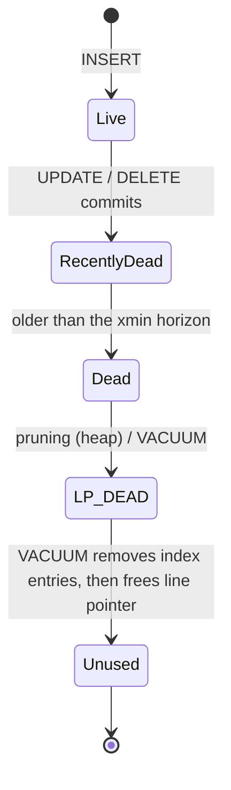

# Dead tuple lifecycle and HOT pruning



- An `UPDATE` is a delete + insert: the old version gets `xmax`, a new version is written, and **every index** gets a new entry pointing at it.
- A tuple is **dead** once no snapshot can see it (deleter committed and is older than the xmin horizon). Until then it's "recently dead" and can't be removed.

## HOT (Heap-Only Tuple) updates

If an update **changes no indexed columns** and the new version **fits on the same page**:

- The new version is a heap-only tuple — **no new index entries**.
- Old version's `t_ctid` points to the new one, forming a **HOT chain**; index entries keep pointing at the chain's root line pointer.
- Later, **pruning** removes dead chain members and turns the root into an `LP_REDIRECT` line pointer.

## Page pruning

Any backend reading a page may **prune** it opportunistically (no VACUUM needed) when free space is low (under ~10% or below the fillfactor target). Pruning reclaims space from dead heap tuples within the page, but can't remove index entries — that needs VACUUM.

```sql
-- HOT ratio: aim high on update-heavy tables
SELECT relname, n_tup_upd, n_tup_hot_upd,
       round(100.0 * n_tup_hot_upd / nullif(n_tup_upd, 0), 1) AS hot_pct
FROM pg_stat_user_tables
WHERE n_tup_upd > 0
ORDER BY n_tup_upd DESC LIMIT 20;

-- leave room on each page for HOT updates
ALTER TABLE orders SET (fillfactor = 85);
```

Improve HOT rate: lower `fillfactor`, drop unused indexes (especially on frequently updated columns).
