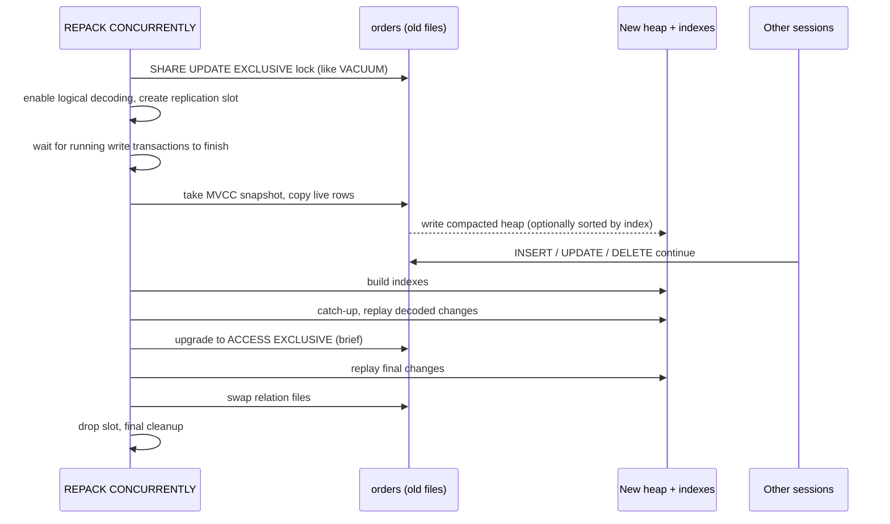

# REPACK CONCURRENTLY (PostgreSQL 19)

PostgreSQL 19 adds a new **`REPACK`** command that combines what `VACUUM FULL` and `CLUSTER` do. Its **`CONCURRENTLY`** option rewrites a bloated table **while reads and writes carry on**, the same job [pg_repack](../../extensions/pg-repack/index.md) and [pg_squeeze](../../extensions/pg-squeeze/index.md) do, but built into core.

!!! info "Status"
    PostgreSQL 19 is in **beta** (Beta 4 released 2026-09-24). Details may still change before the final release. Check the [REPACK docs](https://www.postgresql.org/docs/19/sql-repack.html) for your version.

---

## Syntax

```sql
REPACK [ ( option [, ...] ) ] [ table_name [ ( column_name [, ...] ) ] [ USING INDEX [ index_name ] ] ]
REPACK [ ( option [, ...] ) ] USING INDEX

-- option:
--   VERBOSE [ boolean ]
--   ANALYZE [ boolean ]
--   CONCURRENTLY [ boolean ]
```

!!! note
    Options go **in parentheses**: `REPACK (CONCURRENTLY) orders;`, not `REPACK CONCURRENTLY orders;`.

### Examples

```sql
-- Online rewrite, reads and writes continue
REPACK (CONCURRENTLY) orders;

-- Online, with progress messages and fresh statistics afterwards
REPACK (CONCURRENTLY, VERBOSE, ANALYZE) orders;

-- Online CLUSTER: rewrite in the order of the table's clustering index
REPACK (CONCURRENTLY) orders USING INDEX;

-- Online CLUSTER on a specific index (also records it as the clustering index)
REPACK (CONCURRENTLY) orders USING INDEX orders_created_at_idx;

-- Non-concurrent forms (ACCESS EXCLUSIVE for the whole run)
REPACK orders;                       -- = VACUUM FULL orders
REPACK orders USING INDEX orders_pkey; -- = CLUSTER orders USING orders_pkey
REPACK;                              -- every table in the database you have MAINTAIN on
```

`VACUUM FULL` and `CLUSTER` still work in PG19 for compatibility.

---

## How it works



1. **Initializing:** takes a `SHARE UPDATE EXCLUSIVE` lock (blocks other VACUUM/DDL, not DML). Enables logical decoding if it isn't already on, then **waits for every transaction that has an XID to finish**, including ones that start during the wait.
2. **Copy:** scans the table under an MVCC snapshot (sequential scan, or index scan / sort with `USING INDEX`) and writes a new, compact heap.
3. **Rebuild indexes** on the new heap.
4. **Catch-up:** uses **logical decoding** to replay the inserts, updates and deletes other sessions made during the copy.
5. **Swap:** takes `ACCESS EXCLUSIVE` **only to swap the table and index files**, then cleans up.

---

## Requirements and restrictions

`CONCURRENTLY` cannot be used when:

| Restriction | Notes |
|---|---|
| Table has no **primary key** or index-based **replica identity** | Needed to match decoded changes to rows |
| Table is **partitioned** | Repack each partition instead |
| Table is **UNLOGGED** | |
| Not a plain table | Materialized views, system catalogs, TOAST tables, `user_catalog_table` tables are excluded |
| Access method is not `heap` | |
| Run **inside a transaction block** | Must be a standalone statement |
| No free REPACK replication slot | Limited by `max_repack_replication_slots` |

Also:

- Needs the **`MAINTAIN`** privilege on the table.
- Refuses to run if the table has an **invalid index**. Drop or rebuild it first.
- Needs free disk for a full copy of the table + indexes, and generates WAL roughly the size of the table.
- Logical decoding must be available. With the default `wal_level = replica`, PG19 enables it automatically when needed (`SHOW effective_wal_level;` shows the result).

### Configuration

| Setting | Default | Notes |
|---|---|---|
| `max_repack_replication_slots` | 5 | Max concurrent `REPACK` operations needing a slot. **Restart required** |
| `maintenance_work_mem` | 64 MB | Raise it for faster sorts / index builds |
| `effective_wal_level` | (read-only) | Shows whether logical decoding is currently active |

---

## Caveats

!!! warning "Not MVCC-safe"
    `REPACK (CONCURRENTLY)` is one of the few commands the docs list as **not MVCC-safe** (with `TRUNCATE` and table-rewriting `ALTER TABLE`). A transaction whose snapshot was taken **before** the repack committed will see the table as **empty** afterwards.
    Watch out for long `REPEATABLE READ` / `SERIALIZABLE` transactions and `pg_dump` runs that overlap a repack.

- **Initial wait:** the start-up phase waits for all write transactions, so a long-running transaction delays the start. Check `pg_stat_activity` first.
- **Final lock upgrade:** going from `SHARE UPDATE EXCLUSIVE` to `ACCESS EXCLUSIVE` at the end can **queue behind** long queries, block other sessions while it waits, and in rare cases **deadlock** (one side is aborted). Run it at quiet times and consider `lock_timeout`.
- **Write overhead:** DML on the table is slower while the repack runs, because of the extra logical-decoding WAL and the catch-up work.
- **Replication slot:** like any slot, it retains WAL while it exists. Watch `pg_replication_slots` and disk space if a repack stalls.
- **One table at a time** with `ANALYZE` (the option only works for a single non-partitioned table).

---

## Monitoring progress

```sql
SELECT p.pid,
       p.relid::regclass            AS table,
       p.command,
       p.phase,
       p.heap_blks_scanned,
       p.heap_blks_total,
       round(100.0 * p.heap_blks_scanned / nullif(p.heap_blks_total, 0), 1) AS pct_scanned,
       p.heap_tuples_inserted,
       p.heap_tuples_updated,       -- catch-up phase only
       p.heap_tuples_deleted,       -- catch-up phase only
       p.index_rebuild_count
FROM pg_stat_progress_repack p;
```

Phases: `initializing` → `seq scanning heap` / `index scanning heap` → `sorting tuples` → `writing new heap` → `rebuilding index` → **`catch-up`** (concurrent only, also covers waiting for the final lock) → `swapping relation files` → `performing final cleanup`.

`pg_stat_progress_cluster` still exists as a backwards-compatible view.

---

## REPACK CONCURRENTLY vs the alternatives

| | `REPACK (CONCURRENTLY)` | `VACUUM FULL` / `REPACK` | pg_repack | pg_squeeze |
|---|---|---|---|---|
| Available | PG19+, core | All versions | Extension + client binary | Extension |
| Lock during copy | `SHARE UPDATE EXCLUSIVE` (DML allowed) | `ACCESS EXCLUSIVE` (blocks everything) | Light lock, DML allowed (+ brief exclusive at start and end) | Light lock, DML allowed (+ brief exclusive at end) |
| Change capture | Logical decoding | — | Triggers | Logical decoding |
| Needs PK / replica identity | Yes | No | Yes (PK or unique NOT NULL) | Yes |
| Index ordering (online CLUSTER) | `USING INDEX` | `USING INDEX` | `-o` / cluster index | Clustering index |
| Scheduling | Use pg_cron | Use pg_cron | Use cron | Built in |
| Managed DBs (RDS etc.) | Once they offer PG19 | Yes | Yes | Limited |

Once you're on PG19, `REPACK (CONCURRENTLY)` should replace pg_repack / pg_squeeze for most cases. You no longer need an extension, a matching client binary, or `shared_preload_libraries`.

See also: [VACUUM FULL, pg_repack and table rewrites](vacuum-full-and-rewrites.md), [Bloat causes](bloat-causes.md), [pgstattuple](../../extensions/pgstattuple/index.md) for measuring bloat first.

## Sources

- [REPACK reference (PG19 docs)](https://www.postgresql.org/docs/19/sql-repack.html)
- [Progress reporting: pg_stat_progress_repack](https://www.postgresql.org/docs/devel/progress-reporting.html)
- [PostgreSQL 19 release notes](https://www.postgresql.org/docs/19/release-19.html)
- [depesz: Waiting for PostgreSQL 19 – Add CONCURRENTLY option to REPACK](https://www.depesz.com/2026/04/21/waiting-for-postgresql-19-add-concurrently-option-to-repack/)
