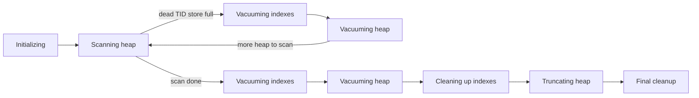

# VACUUM phases



| Phase | What happens |
|---|---|
| **Scanning heap** | Reads pages not skippable via the VM, prunes, collects dead TIDs into memory, freezes tuples, sets VM bits |
| **Vacuuming indexes** | Scans **every index in full** and deletes entries pointing to the collected dead TIDs |
| **Vacuuming heap** | Marks the dead line pointers `LP_UNUSED`, updates FSM |
| **Cleaning up indexes** | Index AM post-processing, updates index stats |
| **Truncating heap** | Returns empty pages at the **end** of the table to the OS — needs a brief `ACCESS EXCLUSIVE` lock |
| **Final cleanup** | Updates FSM, `pg_class.relfrozenxid`, stats |

If dead TIDs don't fit in `maintenance_work_mem` / `autovacuum_work_mem`, the index + heap phases repeat — multiple full index scans. PG17's TidStore uses far less memory, so this is much rarer.

```sql
SELECT p.pid, p.relid::regclass, p.phase,
       p.heap_blks_scanned, p.heap_blks_total,
       round(100.0 * p.heap_blks_scanned / nullif(p.heap_blks_total, 0), 1) AS pct_scanned,
       p.index_vacuum_count
FROM pg_stat_progress_vacuum p;
```

Plain `VACUUM` takes `SHARE UPDATE EXCLUSIVE` — normal reads and writes continue. Disable truncation on hot tables with `ALTER TABLE t SET (vacuum_truncate = off)` if the end-of-vacuum lock causes stalls.
