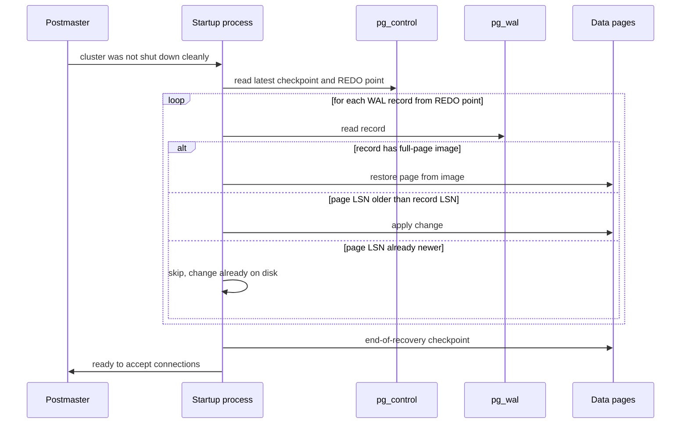

# Crash recovery and redo

- Replay is **idempotent** thanks to the page LSN comparison.
- Uncommitted transactions need no undo: their changes are replayed but their XIDs have no commit record, so they're aborted in clog and invisible.
- Recovery time ≈ WAL generated since the last checkpoint — bounded by `checkpoint_timeout` / `max_wal_size`.
- The same machinery drives **streaming replication** and **PITR**: a standby is a server in permanent recovery.
